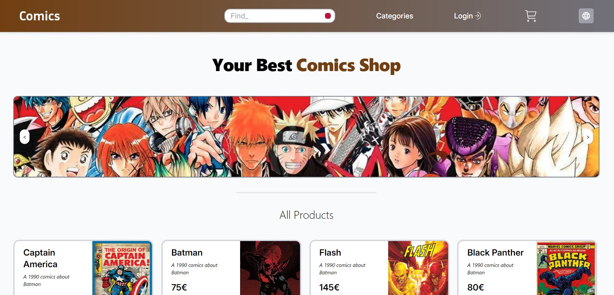

# Comics Shop Frontend

## Project Overview

This is the frontend of an e-commerce web application where users can browse products, register, log in, add products. It is built using React and communicates with the backend API for data such as user authentication, products, and CRUD operations



## Features

- **User Authentication**: Registration and login form with validation.
- **Admin Panel**: Admin can add and delete and edit existing product.
- **Product Listing**: Users can browse products by category.
- **Responsive Design**: Optimized for mobile and desktop views.

## Tech Stack

- **React**: The core library for building the UI.
- **Tailwind CSS**: For styling and responsive layout.
- **Firebase**: Used for storing product images.
- **React Router**: For navigation between different views.
- **Fetch API**: For making HTTP requests to the backend API.

## Prerequisites

- **Node.js** v16.x or higher
- **npm** v7.x or higher

## Installation

### 1. Clone the repository

```bash
git clone https://github.com/Danil22May/P3-Digital-Academy-Project-ComicsShop-Frontend
```

### 2. Install dependencies

```bash
npm install
```

### 3. Run the project

To start the development server, run:

```bash
npm run dev
```

The app will be available at `http://localhost:5173/`.

## Project Structure

```
/src
  /components        - Reusable components (e.g., ProductCard, Navbar, etc.)
  /services          - API service for handling requests to the backend
  App.js             - Main application entry point
  index.js           - Main React DOM rendering entry
```

## Key Functionality

### User Authentication

- **Login**: Users can log in via the `/login` route by providing their credentials. The credentials are checked by the backend.

### Product Catalog

- **Product Listing**: Products are fetched from the backend API and displayed on the homepage.

### API Integration

The frontend communicates with the backend through REST API calls using the `fetch` function. Examples of the key API calls:

- **Register User**: `POST /api/v1/auth/register`
- **Login User**: `POST /api/v1/auth/login`
- **Fetch Products**: `GET /api/v1/products`

### Routing

React Router is used for navigating between the following key views:

- `/login`: Login page
- `/categories`: Categories page

## Available Scripts

- `npm run dev`: Runs the app in development mode.

## Future Improvements

- **Form Validation**: Add more advanced validation and feedback on login and registration forms.
- **Error Handling**: Improve error messages and UX for failed API requests.
- **UI Enhancements**: Improve design and UX for the product and cart views.
